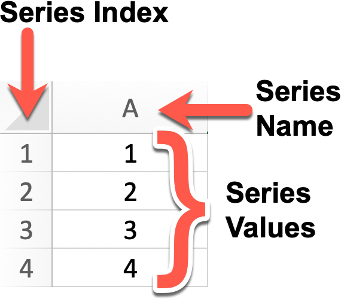

# Let's get started with Pandas. Introducing Pandas Series

In case you are not aware of who, or what, `pandas` is, [pandas](https://pandas.pydata.org/) is an open source, BSD-licensed library providing high-performance, easy-to-use data structures and data analysis tools for the Python programming language.

The two primary data structures in `pandas` are the ***Series*** and the ***DataFrame***. The simplest way to visualise  these two structures is to use an analogy with your favourite Spreadsheet application. Think a a `pandas` Series as Column A, 1 dimension,  plus the row indexes. A Dataframe is the whole spreadsheet, 2 dimensions, with both rows and columns.

This is what a Series looks like in a Spreadsheet.



In a spreadsheet the row indexes typically start at `1` and the column names typically start at `A`. The Series called `A` above has four value `[1, 2, 3, 4]`.

This is what a similar Series looks like in `pandas`:

```>>> x
>>> x
0    1
1    2
2    3
Name: Fred, dtype: int64
```

The `pandas` Series Python variable is named `x`. The default index, like all other Python objects, are zero-based so the index values are `[0, 1, 2]`and the series values are `[1, 2, 3]`. The sample `x` series shown is called `Fred` and all the series values are of type `int64`.

Now that you know everything that you need to know about `pandas` Series it's time for you to start creating some series of your own. In this Bite you are asked to complete a number of functions that each create a `pandas` Series. How you create each series is up to you but if you do your research you'll find that Series can be created from all different type of Python Objects:

1. Create a Series with values `[1, 2, 3, 4, 5]` of type `int64`, don't worry about the index
2. Create a Series with values `[0.000, 0.001, ... 0.999, 1.000]` of type `float64`, don't worry about the index
3. Create a Series with values `[1, 2, 3, 4, 5]` of type `int64`, don't worry about the index